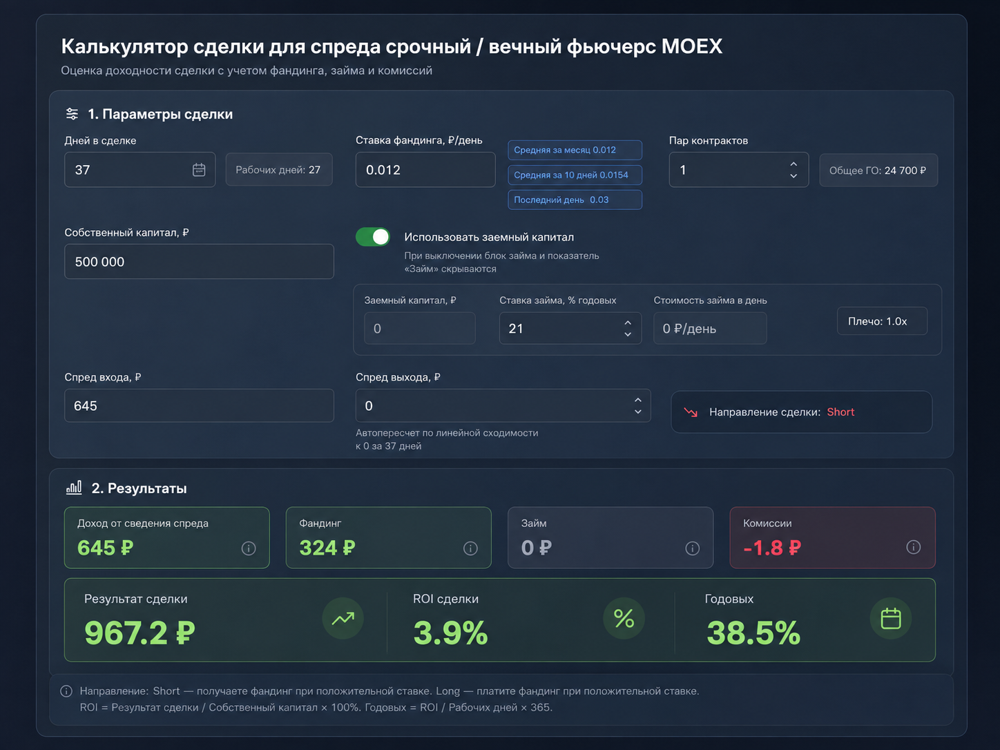

# Калькулятор сделки для спреда MOEX

Интерактивный SPA-прототип для оценки сделки между срочным и вечным фьючерсами MOEX. Калькулятор реактивно учитывает сведение спреда, фандинг, комиссии, заемный капитал, ROI и годовую доходность.

## Скриншот

После запуска приложение выглядит как компактный dark-fintech калькулятор. Визуальный референс:



## Требования

- Node.js 20.19+ (для workflow используется Node.js 22)
- npm 10+

## Запуск

```bash
npm install
npm run dev
```

Vite выведет локальный адрес приложения в терминале.

## Проверка и сборка

```bash
npm run typecheck
npm test
npm run build
npm run preview
```

Готовая production-сборка появляется в `dist/`.

## Публикация на GitHub Pages

Workflow [`.github/workflows/deploy.yml`](.github/workflows/deploy.yml) при каждом push в `main` устанавливает зависимости, собирает приложение и публикует `dist/` официальными GitHub Pages Actions. Относительный `base: './'` позволяет публиковать проект независимо от имени репозитория.

В настройках GitHub откройте **Settings → Pages** и выберите **Source: GitHub Actions**. После следующего push в `main` адрес появится в завершившемся workflow и в разделе Pages.

## Конфигурация

Все заменяемые бизнес-константы собраны в [`src/config/dealConfig.ts`](src/config/dealConfig.ts): дата экспирации, ГО на пару, комиссия, начальный капитал, ставка займа, множитель и пресеты фандинга.

Основные формулы и чистая функция `calculateDeal` находятся в [`src/composables/useDealCalculator.ts`](src/composables/useDealCalculator.ts).

## Расчеты

- Сведение спреда: `|спред входа − спред выхода| × пары`.
- Фандинг: ставка × 1 000 × пары × рабочие дни. Для Short спреда вечный фьючерс находится в Long, поэтому фандинг отрицательный; для Long спреда — положительный.
- Комиссия: `пары × 0,45 ₽ × 4`.
- Займ покрывает разницу между общим ГО и собственным капиталом.
- ROI без займа считается от общего ГО, при фактическом займе — от использованного собственного капитала под ГО.
- Годовая доходность использует календарные дни сделки.

Проект не использует backend, роутер или глобальное хранилище.
